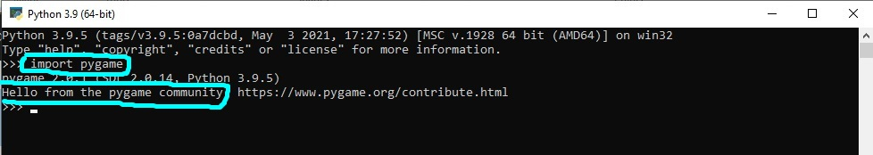
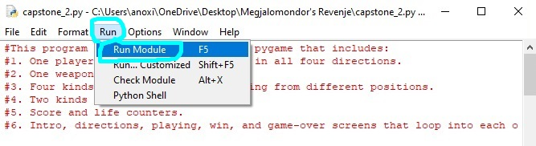

# Installing and running Python and Pygame

## How to install Python 

* Go to [**Python.org**](Python.org/downloads):

* Click **"Download Python 3.9.5"** or choose a different OS:

* Save file in preferred location:

* Run the **.exe** file. 
* Click "Customize installation":

* Leave **Optional Features** as is and click **"Next"**:

* In **Advanced Options** tick **"Install for all users"** and click **"Install"**:

* Click **"Yes"** and wait for install:

* **Setup was successful** should display after install. Click **"Close"**:

* Search for and open **Command Prompt**:

* Type **"cd C:\Program Files\Python39"** (or change directory to your Python locatation):

* Type **"python --version"**, and the installed version should be displayed:

## How to install pygame

### Check for PIP installation
* Pip is a tool used to install Python packages.
* It should be automatially installed with Python 3.4 +.
* To check if it is installed, open Command Prompt:

* Navigate to path containing **"Python39\Scripts"** (using **"cd C:\file path"**) and press **"Enter"**:

* Type **"pip --version"** and press **"Enter"** - version should display:

### Install pygame
* Type **"pip install pygame"** and press **"Enter"**.

* You should see a **"Successfully installed pygame"** message:

* Open the Python terminal:

* Type **"import pygame"** and press **"Enter""**.

* You should see a **"Hello from the pygame community" message"**:

## How to run a program via IDLE

We need an [**IDE**](https://www.codecademy.com/articles/what-is-an-ide) to make programming easier. Python comes with its own one, **IDLE**:

* Search for the folder where you saved **capstone_2.py** (or any other Python file).
* **Make sure all the game images and font located in the "Game-images" folder are copied to the same folder**.
* Right click on the icon, and choose **"Edit with IDLE"**:

* The file should open. Click the **"Run"** tab and **"Run Module"**:

* You should now see game running in the **IDLE** console:

And that's it - you're good to go! 
