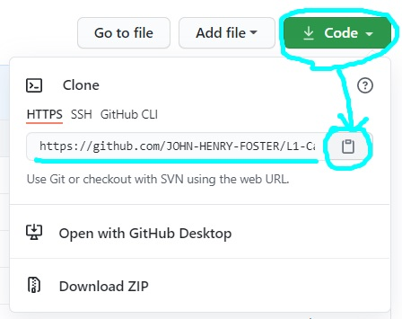
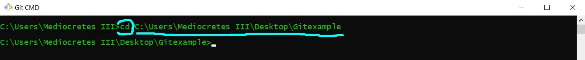

# Contributing via the fork-and-branch workflow

## Fork this repository 
* This creates a copy of this repository in your **Github** account.
* Make sure you are logged into your account.
* Find this repository.
* Click **"Fork"** in the upper right hand corner, and your'e done!


## Make a local clone
* Make sure you have [**Git**](https://docs.github.com/en/github/getting-started-with-github/quickstart/set-up-git) installed on your local machine.
* Go to your forked repository (the one you just created). 
* Click **"Code"** and under **"Clone"** select **"HTTPS"** and copy the URL:



* In **Git CMD** on your local machine, navigate to the folder where you want to clone the repository using **"cd"**:



* Then type:

```
git clone [url]
```   
* Git just copied your forked repository to your local machine.

## Add a remote repository
* Git already added a remote called origin to your local machine. 
* This allows you to push changes back to the fork on Github.
* You also have to add the original repository you forked from as a remote.
* In **Git CMD**, type:

```
git remote add
```

* The shortname can be anything you want. We used "upstream".
* The URL is the clone URL of the original repository.

## Create a new branch
* This makes changes easier to keep track of and control.
* In **Git CMD**, type:

```
git checkout -b [new branch name]
```
* This creates a new branch and checks it out (i.e. tells Git you will be making changes to it).
* You can now work on the file and save your changes.		
* Add the file if you are ready to commit by typing:

```
git add [file name]
```
